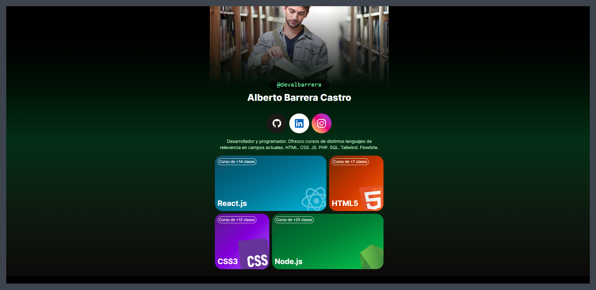

# Presentación de Informático
Página experimental realizada con HTML y Tailwind CSS de perfil informático. <br>
Este proyecto ha sido desplegado en Netlify con la siguiente dirección. https://variado-tailwind-course.netlify.app/

<hr>

<hr>

# Requerimientos
- Node.js (Utilizado: 20.17.0, recomendado: 18.x o superior)
- pnpm (Utilizado: 8.12.1, compatible con 10.x)

<hr>

# Recomendado
- VSCode con extensión Tailwind CSS IntelliSense para autocompletado y sugerencias.
- Live Server o servidor local para visualizar correctamente las rutas.

<hr>

# Dependencias
- Este proyecto utiliza únicamente HTML y Tailwind CSS.
- No se han utilizado frameworks ni librerías externas adicionales.
- Las dependencias instaladas vía pnpm son:
  - tailwindcss
  - @tailwindcss/cli
  - @midudev/tailwind-animations

<hr>

# Instalación
### 1. Clona el repositorio
Utiliza tu gestor git de preferencia (ej: GitHub Desktop) o clona desde la terminal.
```bash
git clone https://github.com/tu-usuario/variado-tailwind-course.git
cd variado-tailwind-course
```

### 2. Instala las dependencias
```bash
pnpm install
```

### 3. Script personalizado en `package.json`
Utilizado para poder compilar estilos con Tailwind en tiempo real y visualizar (ej: con Live Server)
```bash
"scripts": {
  "build:styles": "pnpm exec tailwindcss -i ./css/input.css -o ./css/output.css --watch"
}
```
```bash
pnpm run build:styles
```
# Observaciones y comentarios
### 1. Estilos
- Se utilizó `@apply` en style.css para mantener el HTML limpio. Reemplazar con componentes a futuro.<br>
- Los estilos se compilan desde input.css usando Tailwind CLI.

### 2. SVGs
- Los íconos se cargan desde `sprite.svg` con `<use href="...">`.
- Requieren entorno `http://localhost` para funcionar correctamente.

### 3. Tipografía
- Se incluyó una fuente `(inter-variable.woff2)` para pruebas tipográficas.